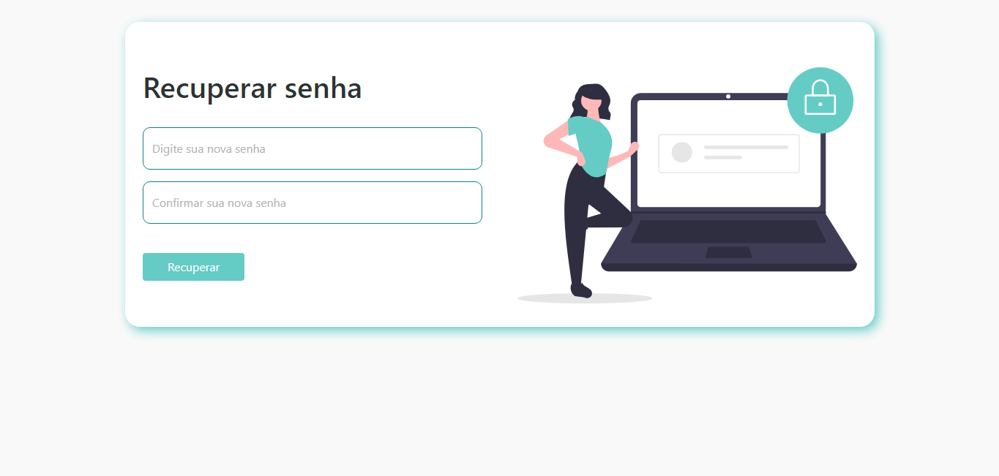

# Login com Bootstrap 5
Página de login, registro e recuperação de senha usando formulários do bootstrap 5

 Trabalhando com formulários Bootstrap

> Em desenvolvimento...

<a href="https://helenaoliveira366.github.io/Login-com-Bootstrap-5/">Acesse aqui o projeto</a>

## Tecnologias usadas:
- HTML 5
- CCS 3
- Bootstrap 5

## Telinhas do projeto

